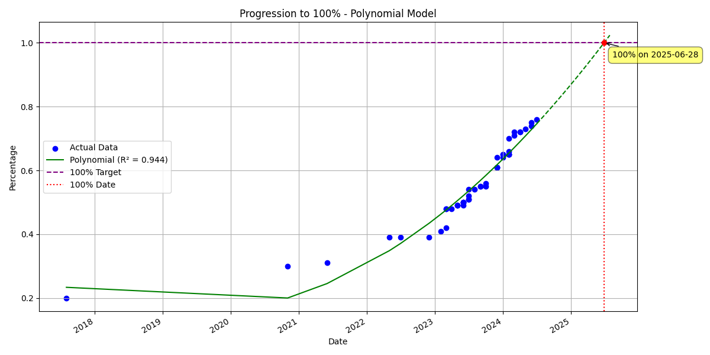

# Alans Conservative Countdown to AGI Chart

## Overview

This project is designed to track and predict the progression towards Artificial General Intelligence (AGI). It scrapes data from a specified website, analyzes the progression of AGI development over time, and predicts when 100% AGI capability might be achieved.

## Features

- Web scraping of AGI progression data
- Data analysis using polynomial regression
- Visualization of AGI progression and prediction
- Prediction of the date when 100% AGI capability might be reached

## Requirements

- Python 3.7+
- Required Python packages:
  - numpy
  - pandas
  - matplotlib
  - scikit-learn
  - beautifulsoup4
  - requests

## Installation

1. Clone this repository:

   ```
   git clone https://github.com/andyg2/Alans-Conservative-Countdown-to-AGI-Chart.git
   cd Alans-Conservative-Countdown-to-AGI-Chart
   ```
2. Install the required packages:

   ```
   pip install -r requirements.txt
   ```

## Usage

Run the main script:

```
python predict.py
```

This will:

1. Scrape the latest AGI progression data from the specified website
2. Perform data analysis and prediction
3. Generate a plot showing the progression and prediction
4. Print the predicted date for reaching 100% AGI capability

## How it Works

1. **Web Scraping**: The script scrapes data from a specified URL ([https://lifearchitect.ai/agi/](https://lifearchitect.ai/agi/)) to get the latest AGI progression percentages.
2. **Data Processing**: The scraped data is processed and converted into a pandas DataFrame for analysis.
3. **Regression Analysis**: A polynomial regression model is fitted to the data to capture the trend of AGI progression.
4. **Prediction**: The model is used to predict when the AGI progression might reach 100%.
5. **Visualization**: A plot is generated showing the actual data points, the regression line, and the prediction for reaching 100%.

## Output

- A matplotlib plot showing:

  - Actual data points of AGI progression
  - Polynomial regression line
  - Prediction line extending into the future
  - Vertical line indicating the predicted 100% date



- Console output including:

  - Predicted date for reaching 100% AGI capability
  - R-squared value of the regression model
  - Most recent data point (date and percentage)

```
Polynomial Regression 100% Date: July 11, 2025
R-squared value: 0.945
Most recent data point:
Date: July 01, 2024
Percentage: 76.0%
```

## Limitations

- The prediction is based on historical data and assumes that the trend will continue in a similar fashion.
- The accuracy of the prediction depends on the quality and consistency of the input data.
- This is a simplified model and does not account for potential breakthroughs or setbacks in AGI development.

## Contributing

Contributions to improve the script or extend its functionality are welcome. Please feel free to submit pull requests or open issues for discussion.

## License

This project is open source and available under the [MIT License](LICENSE).

## Disclaimer

This project is for educational and research purposes only. The predictions should not be taken as definitive statements about the future of AGI development.
